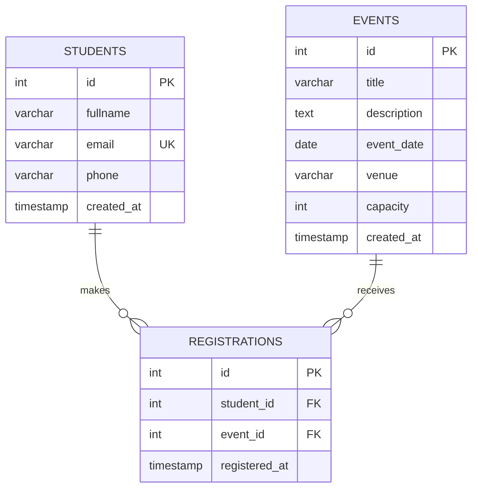

# StudentHub — Entity Relationship Diagram

This ER diagram represents the relationships between students, events, and registrations.

```mermaid
erDiagram
    STUDENTS ||--o{ REGISTRATIONS : makes
    EVENTS ||--o{ REGISTRATIONS : receives

    STUDENTS {
        int id PK
        varchar fullname
        varchar email UK
        varchar phone
        timestamp created_at
    }

    EVENTS {
        int id PK
        varchar title
        text description
        date event_date
        varchar venue
        int capacity
        timestamp created_at
    }

    REGISTRATIONS {
        int id PK
        int student_id FK
        int event_id FK
        timestamp registered_at
    }
```
